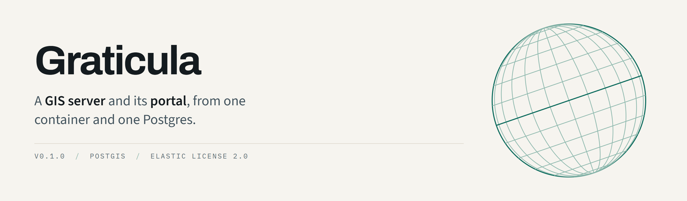

<picture>
  <source media="(prefers-color-scheme: dark)" srcset="docs/banner-dark.png">
  
</picture>

**A GIS server and its portal, in one process.** `Server` does what a GIS Server site
does — services at `/rest/services`, published out of PostGIS, opened by the clients you
already have. `Studio` does what the portal does for content and people — items, members,
roles, groups, sharing. ArcGIS Pro connects, browses, adds the layer and edits it.

The three tiers are fused rather than federated
([ADR-019](docs/adr/ADR-019-portal-server-split.md)), so there is no site to create, no
data store tier to install and no portal to federate. What Studio does *not* do is author:
no web maps, no app builder, no Living Atlas — the services are the product and the client
is yours.

**[The overview page](https://erdinckyildiz.github.io/graticula/)** says the same thing
with room to breathe. A *graticule* is the net of meridians and parallels drawn on a map;
`Graticula` is the Medieval Latin word English borrowed it from.

> **v0.1.0 — not 1.0.** It runs and it is tested; it has not yet been operated in
> production by anybody but its author.

---

## What runs

Five ArcGIS service types, plus the portal surface Pro connects through.

| | | |
|---|---|---|
| **Feature services** | complete | `query`, `applyEdits`, attachments, related records, `generateRenderer` — over a registered PostGIS table or a hosted layer |
| **Map services** | complete | `export`, `identify`, `legend`. A layer published without a style gets a generated appearance that reports itself as generated |
| **Vector tile services** | partial | Tiles from hosted data, a style document and a checked-in glyph set. **The sprite sheet answers and is empty** — no icon library, and no way to upload one ([ADR-027](docs/adr/ADR-027-glyphs-and-sprites.md)) |
| **Image services** | partial | `exportImage`, `identify`, `tile`, over imagery registered where it lies and never copied. **No raster function chains, no mosaic datasets** |
| **Geometry service** | partial | 18 of 22 operations, including `buffer`, `intersect`, `union`, `difference` and `cut`. **The four that are missing each refuse in their own words**, with the reason that applies to them ([ADR-022](docs/adr/ADR-022-geometry-server.md)) |
| **ArcGIS Pro** | complete | Add a **portal** connection, sign in, browse My Content, add a layer, edit it. Measured against Pro over seven rounds, each read out of the request log ([ADR-040](docs/adr/ADR-040-the-portal-surface-is-how-arcgis-pro-connects.md)) |

Around them: members, roles with editable privileges, groups and item sharing, with every
mutation audited and the log queryable; import from GeoJSON, a zipped shapefile or a File
Geodatabase, or define an empty schema and fill it through `applyEdits`.

OGC API Features, WFS 2.0 and WMS 1.3.0 are served as well; [docs/](docs/) has the detail,
and [docs/reviews/](docs/reviews/) has the OGC CITE runs behind them.

## What is missing

On the front page on purpose. Each is a limit today, not a smaller version of something
that works.

- **PostGIS, and nothing else.** No Oracle, no SQL Server, no file geodatabase served in
  place. An enterprise geodatabase on Oracle has to move first. The other engines are
  deferred, not cancelled — [v1-scope.md](docs/v1-scope.md) §3a.
- **No single sign-on.** Local accounts and server-issued tokens only: no SAML, no OIDC,
  no Active Directory, no SCIM. Every account is one you create here.
- **No geoprocessing and no geocoding.** No GPServer, no web tools, no Python toolboxes.
- **No *New ArcGIS Server* connection.** That handshake is SOAP; it is not built and not
  planned. A portal connection reaches the same content.
- **No publishing from Pro.** The portal surface is read-only. Publish in the console or
  over the admin API.
- **No migration tooling yet.** Reading an existing site's inventory and importing its
  service definitions is scoped and unwritten. Moving today means republishing by hand.
- **Labels in three scripts.** The shipped glyph set is Latin, Greek and Cyrillic — 7,720
  glyphs. **Chinese, Japanese, Korean and Devanagari are not in it**, and a deployment that
  needs them cannot label a map with what ships here ([ADR-027](docs/adr/ADR-027-glyphs-and-sprites.md)).
- **One machine.** No site, no clustering, no failover.

## Quickstart

Docker and Docker Compose. Nothing else — no .NET SDK, no PostgreSQL, no `openssl`.
These four commands are rehearsed on every push from an empty machine, so this section
is checked rather than remembered.

```bash
# Optional: pin a release rather than following `latest`. Both images are on GHCR and
# compose.yaml pulls them; with no network it builds from this repository instead.
export GIS_TAG=0.1.0

# 1. A key to seal registered data source credentials. There is no default, deliberately:
#    a published default key would make every credential in every deployment that forgot
#    to change it readable from a backup.
docker compose run --rm --no-deps server keygen
echo "GIS_SECRET_KEY=<the value it printed>" > .env

# 2. Create the schema. Explicit, never automatic — an old image started by accident must
#    not silently rewrite a newer schema.
docker compose run --rm server migrate --apply

# 3. Start.
docker compose up -d

# 4. The server has no administrator, so it refuses everything except setup and writes a
#    one-time token to its log.
docker compose logs server | grep -A2 "SETUP REQUIRED"

curl -k -X POST https://localhost:8443/rest/setup \
  -H "Content-Type: application/json" \
  -d '{"token":"<the token>","name":"root","password":"a properly long password"}'
```

`-k` because the server generates a self-signed certificate on first run and keeps it in a
volume. It survives a container replacement; install a real one when you have one.

`docker compose down` and `up` keeps the platform database, your registrations, accounts,
sessions and the serving certificate. Only `down -v` destroys it.

### Publishing something

Sign in, test a database before registering it, register it, then publish a table.

```bash
TOKEN=$(curl -sk -X POST https://localhost:8443/rest/auth/login \
  -H "Content-Type: application/json" \
  -d '{"name":"root","password":"a properly long password"}' | jq -r .token)

# Creates nothing, and tells you which of the three failure classes you have: unreachable,
# connected but unprivileged, or connected but with nothing publishable.
curl -sk -X POST https://localhost:8443/admin/datasources/test \
  -H "Authorization: Bearer $TOKEN" -H "Content-Type: application/json" \
  -d '{"connectionString":"Host=your-db;Port=5432;Database=gis;Username=...;Password=..."}'

curl -sk -X POST https://localhost:8443/admin/datasources \
  -H "Authorization: Bearer $TOKEN" -H "Content-Type: application/json" \
  -d '{"name":"my-postgis","connectionString":"..."}'

# Layers are private to their owner until shared.
curl -sk -X POST https://localhost:8443/admin/layers \
  -H "Authorization: Bearer $TOKEN" -H "Content-Type: application/json" \
  -d '{"name":"places","dataSourceId":"<id>","schemaName":"public",
       "tableName":"places","geometryColumn":"geom","identityColumn":"objectid",
       "objectIdColumn":"objectid","srid":4326,"geometryType":"Point",
       "sharing":"public"}'
```

It is then a FeatureServer at
`https://localhost:8443/rest/services/places/FeatureServer/0`, discoverable from
`/rest/info` the way any ArcGIS client expects.

### A service of several layers, in one act

One table is one layer. A service of several — with group layers, in a chosen order — is a
single request, written in one transaction or not at all. There is no empty container to make
first and fill afterwards: a service is not created without layers
([ADR-057](docs/adr/ADR-057-composing-and-publishing-a-service.md)).

```bash
curl -sk -X POST https://localhost:8443/admin/publish \
  -H "Authorization: Bearer $TOKEN" -H "Content-Type: application/json" \
  -d '{"name":"cadastre","folder":"hosted","sharing":"private",
       "srid":3857,
       "capabilities":["Query"],
       "nodes":[
         {"layer":{"name":"parcels","dataSourceId":"<id>","schemaName":"public",
                   "tableName":"parcels","geometryColumn":"geom","identityColumn":"objectid",
                   "objectIdColumn":"objectid","srid":4326,"geometryType":"Polygon"}},
         {"group":"Planning","layers":[
           {"name":"zoning","dataSourceId":"<id>","schemaName":"public",
            "tableName":"zoning","geometryColumn":"geom","identityColumn":"objectid",
            "objectIdColumn":"objectid","srid":4326,"geometryType":"Polygon"}]}]}'
```

`srid` is the reference the whole service answers in, whatever its tables are stored in —
reprojection happens on the way out. Where a grid has no EPSG code, send `sridWkt` with the
definition instead; the two are exclusive and the server refuses a reference it cannot project
to before it writes anything.

`capabilities` is a ceiling and never a grant: what a caller may do is that set intersected with
their privileges and with what the data supports. `servesFeatures` and `servesTiles` turn the
two faces on and off.

The same act has a screen — **Server › Publish** — which composes the tree by dragging tables
out of the registered databases, draws the result out of those databases *before* any of it is
published, and sends this request when you press Publish.

### If nobody can administer it any more

A store with accounts and no administrator cannot be recovered from the API, because every
route that would fix it needs the privilege that is missing. Setup does not re-arm itself:
a server that printed a fresh credential whenever the last administrator disappeared would
be printing one for whoever arranged that.

```bash
GRATICULA_ADMIN_PASSWORD='a properly long password' \
  docker compose run --rm -e GRATICULA_ADMIN_PASSWORD server \
  tools admincreator --name root
```

It refuses on a store that already has an administrator. `docker compose run --rm --no-deps
server --help` lists this and the other commands.

## Building

```bash
dotnet build
dotnet test --filter "Category!=Integration"
```

Integration tests need a PostgreSQL and are excluded by default. They **fail rather than
skip** when asked for without one — a test that goes green with its subject absent is worse
than no test, and this project has caught three instruments lying already.

```bash
export GRATICULA_TEST_PG="Host=localhost;Port=55432;Database=gis;Username=gis;Password=gis"
dotnet test --filter "Category=Integration"
```

The conformance suite needs a **running server** and a fixture name for each shape it
checks. It also fails rather than skips, and each failure names the variable it wanted, so
a first run reads as a checklist. The fixtures cannot be discovered from the catalogue: a
published layer may legitimately have no tiles, and a server that had silently gone back to
one layer per service would pass every suite that looked for "a service".

```bash
export GRATICULA_TEST_URL="https://127.0.0.1:8443"
export GRATICULA_TEST_USER="root"
export GRATICULA_TEST_PASSWORD="…"
export GRATICULA_TEST_QUERYABLE="buildings"                     # a feature service
export GRATICULA_TEST_MULTILAYER="hosted/EarlyAlert_Reports_HD" # more than one layer
export GRATICULA_TEST_GROUPED="hosted/EarlyAlert"               # contains a group layer
export GRATICULA_TEST_TILE_SERVICE="hosted/parcels"             # has a VectorTileServer
export GRATICULA_TEST_EDITABLE="editable"                       # layer 0 accepts edits
```

## The record

Every decision here has an ADR with the alternatives it beat, every assumption has the
status of its evidence, and every temporary compromise has the condition that forces it to
be repaid. If you disagree with a choice, the argument it lost is written down.

```bash
python tools/status-page.py    # writes docs/status.html
```

Nothing on that page is typed by hand — the two versions that were went stale within a day,
and a status page that is wrong is most confidently wrong about whatever changed last.

- [docs/v1-scope.md](docs/v1-scope.md) — what is being built, and what was cut
- [docs/open-questions.md](docs/open-questions.md) — uncertainty is recorded, not hidden
- [docs/architecture-debt.md](docs/architecture-debt.md) — compromises, with repayment triggers
- [docs/reviews/](docs/reviews/) — three independent adversarial reviews and the OGC CITE runs
- [docs/build-vs-adopt-policy.md](docs/build-vs-adopt-policy.md) — what we write and what we
  adopt. No library type may appear in a core signature, and that is a build failure rather
  than a convention
- [benchmarks/mvt-generation/RESULTS.md](benchmarks/mvt-generation/RESULTS.md) — three
  measured rounds against 6.5 million OpenStreetMap polygons. Benchmark code is disposable
  and never promoted; the findings are what carried into the production types
- [CONTRIBUTING.md](CONTRIBUTING.md) · [SECURITY.md](SECURITY.md)

## Licence

**Elastic License 2.0** — source-available. Read it, run it, change it, distribute it,
charge money for it. The one thing you may not do is offer it to third parties as a hosted
or managed service. That is the whole restriction
([ADR-047](docs/adr/ADR-047-the-outbound-licence-is-elastic-2.md)).

See [LICENSE](LICENSE), [NOTICE](NOTICE) and
[DEPENDENCY-LICENSES.md](DEPENDENCY-LICENSES.md).
